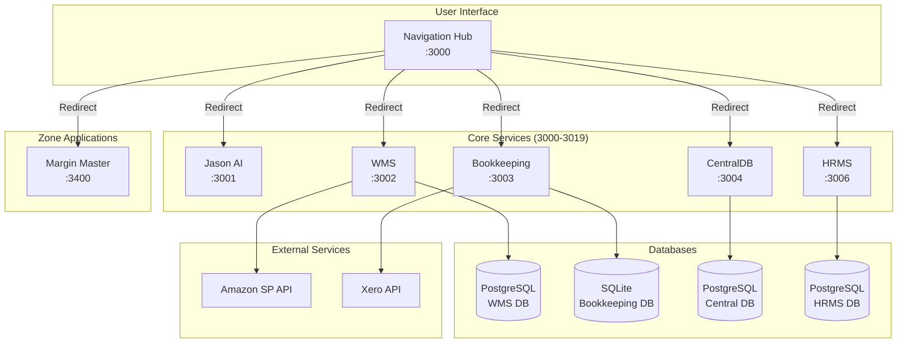

# Ecom OS Architecture Overview

## System Architecture



## Port Allocation Strategy

The Ecom OS ecosystem uses a structured port allocation strategy with 20-port spacing between zones:

### Zone Distribution
- **Core Services (3000-3019)**: Essential infrastructure and shared services
  - 3000: Navigation Hub
  - 3001: Jason AI Assistant
  - 3002: WMS
  - 3003: Bookkeeping
  - 3004: CentralDB
  - 3006: HRMS
  - 3007-3019: Future core services

- **Finance Zone (3020-3039)**: Financial management applications
- **Operations Zone (3040-3059)**: Operational excellence tools
- **Sales & Marketing Zone (3060-3079)**: Customer-facing applications
- **Product Development Zone (3080-3099)**: Product and development tools

Note: Margin Master (3400) is a legacy placement that will remain at its current port.

## Application Architecture Patterns

### 1. Warehouse Management System (WMS)

#### Domain-Driven Design
```
src/
├── modules/
│   ├── operations/       # Core warehouse operations
│   │   ├── inventory/
│   │   ├── receiving/
│   │   └── shipping/
│   ├── finance/          # Financial management
│   │   ├── invoicing/
│   │   ├── reconciliation/
│   │   └── reporting/
│   ├── configuration/    # System configuration
│   │   ├── products/
│   │   ├── warehouses/
│   │   └── rates/
│   └── admin/           # Administration
│       ├── users/
│       └── settings/
```

#### Key Architectural Decisions

1. **Immutable Ledger Pattern**
   - All inventory transactions are immutable
   - No updates or deletes allowed
   - Audit trail maintained automatically
   - Point-in-time queries supported

2. **Event Sourcing (Partial)**
   - Transaction log serves as event stream
   - Current state derived from transaction history
   - Enables time-travel queries

3. **CQRS Pattern**
   - Separate read models for reporting
   - Write models for transactions
   - Optimized query patterns

### 2. Bookkeeping Module

#### Simple CRUD Architecture
```
app/
├── api/
│   └── v1/
│       └── bookkeeping/
│           ├── rules/     # Rule management
│           └── stats/     # Dashboard stats
├── bookkeeping/
│   ├── page.tsx          # Dashboard
│   └── rules/            # Rule CRUD pages
```

#### Design Principles
- **Simplicity First:** Minimal complexity
- **Single Responsibility:** Focused on categorization
- **Stateless API:** RESTful design
- **Client-Side State:** React Query for caching

### 3. PortalDB (Active - Core Service)

#### Data Warehouse Architecture
```
Future Architecture:
├── ETL Pipeline
│   ├── Extractors (from WMS, Bookkeeping)
│   ├── Transformers (data normalization)
│   └── Loaders (to portal DB)
├── Analytics Engine
│   ├── Real-time dashboards
│   ├── Historical reports
│   └── Predictive analytics
└── API Gateway
    ├── GraphQL endpoint
    └── REST endpoints
```

## Database Design Patterns

### WMS Database

#### Immutable Transaction Log
```sql
-- Transactions cannot be updated/deleted
CREATE TABLE inventory_transactions (
    id UUID PRIMARY KEY,
    created_at TIMESTAMP NOT NULL DEFAULT NOW(),
    -- No updated_at field
    -- Triggers prevent updates/deletes
);
```

#### Chronological Integrity
```sql
-- Ensure transactions are in order
CREATE FUNCTION check_transaction_date()
RETURNS TRIGGER AS $$
BEGIN
    IF NEW.transaction_date < (
        SELECT MAX(transaction_date) 
        FROM inventory_transactions 
        WHERE warehouse_id = NEW.warehouse_id
    ) THEN
        RAISE EXCEPTION 'Cannot backdate transactions';
    END IF;
    RETURN NEW;
END;
$$ LANGUAGE plpgsql;
```

### Bookkeeping Database

#### Simple Schema
```sql
-- Single main entity
CREATE TABLE categorization_rules (
    id TEXT PRIMARY KEY,
    name TEXT NOT NULL,
    match_type TEXT NOT NULL,
    match_field TEXT NOT NULL,
    match_value TEXT NOT NULL,
    account_code TEXT NOT NULL,
    tax_type TEXT NOT NULL,
    priority INTEGER DEFAULT 0,
    is_active BOOLEAN DEFAULT TRUE
);
```

## API Design Standards

### RESTful Conventions

#### URL Structure
```
GET    /api/v1/resources          # List
GET    /api/v1/resources/:id      # Get one
POST   /api/v1/resources          # Create
PUT    /api/v1/resources/:id      # Update
DELETE /api/v1/resources/:id      # Delete
```

#### Response Format
```typescript
// Success Response
{
  "data": T,
  "metadata": {
    "page": 1,
    "limit": 20,
    "total": 100
  }
}

// Error Response
{
  "error": {
    "code": "RESOURCE_NOT_FOUND",
    "message": "User-friendly error message",
    "details": {}
  }
}
```

### Error Handling

#### Error Codes
```typescript
enum ErrorCode {
  // Client errors (4xx)
  BAD_REQUEST = 'BAD_REQUEST',
  UNAUTHORIZED = 'UNAUTHORIZED',
  FORBIDDEN = 'FORBIDDEN',
  NOT_FOUND = 'NOT_FOUND',
  CONFLICT = 'CONFLICT',
  
  // Server errors (5xx)
  INTERNAL_ERROR = 'INTERNAL_ERROR',
  SERVICE_UNAVAILABLE = 'SERVICE_UNAVAILABLE'
}
```

## Authentication & Authorization

### Current State
- `@ecom-os/auth` owns the Prisma schema for the portal `auth` schema inside the shared `portal_db` database.
- The EcomOS portal is the only app running NextAuth; it authenticates against the portal `User` table and projects entitlements into the JWT.
- Downstream apps (WMS, HRMS, FCC, etc.) consume the shared cookie, decode claims via `@ecom-os/auth`, and never touch the user tables directly.
- The `portal_db` Postgres instance hosts per-app schemas (`auth`, `wms`, …) so services can keep their domain data while sharing the auth tables.

### SSO Data Flow
```mermaid
flowchart LR
    User -->|Credentials| Portal
    Portal -->|Prisma (auth schema)| PortalDB[(portal_db)]
    Portal -->|JWT with entitlements| Browser
    Browser -->|cookie| WMS
    Browser -->|cookie| HRMS
    WMS -->|claim validation| @ecom-os/auth
    HRMS -->|claim validation| @ecom-os/auth
```

JWT payload shape
```json
{
  "sub": "user-id",
  "email": "user@example.com",
  "roles": ["admin"],
  "apps": {
    "wms": { "role": "admin", "departments": ["Ops"] },
    "fcc": { "role": "viewer", "departments": ["Finance"] }
  }
}
```

## Performance Architecture

### Caching Strategy

#### Application Level
- React Query for API response caching
- Next.js static generation where possible
- API route caching with proper headers

#### Database Level
- PostgreSQL query result caching
- Indexed queries for common patterns
- Materialized views for reports

### Scaling Considerations

#### Horizontal Scaling
- Stateless applications (can run multiple instances)
- Database connection pooling
- Load balancer ready

#### Vertical Scaling
- Optimized queries
- Efficient data structures
- Background job processing

## Security Architecture

### Defense in Depth

1. **Network Level**
   - HTTPS only in production
   - Firewall rules
   - Rate limiting

2. **Application Level**
   - Input validation (Zod)
   - SQL injection prevention (Prisma)
   - XSS protection
   - CSRF tokens

3. **Data Level**
   - Encryption at rest
   - Encryption in transit
   - PII data masking
   - Audit logging

### Access Control

```typescript
// Role-based access control
enum Role {
  ADMIN = 'admin',    // Full access
  STAFF = 'staff',    // Limited access
  VIEWER = 'viewer'   // Read-only
}

// Resource-based permissions
interface Permission {
  resource: string
  actions: ('create' | 'read' | 'update' | 'delete')[]
}
```

## Deployment Architecture

### Container Strategy
```dockerfile
# Each app as separate container
FROM node:18-alpine
WORKDIR /app
COPY . .
RUN npm ci --only=production
RUN npm run build
EXPOSE 3000
CMD ["npm", "start"]
```

### Environment Configuration
```bash
# Development
NODE_ENV=development
DATABASE_URL=postgresql://localhost/dev

# Staging
NODE_ENV=staging
DATABASE_URL=postgresql://staging/db

# Production
NODE_ENV=production
DATABASE_URL=postgresql://prod/db
```

## Monitoring & Observability

### Logging Strategy
```typescript
// Structured logging
logger.info('Transaction created', {
  transactionId: tx.id,
  userId: user.id,
  warehouseId: warehouse.id,
  amount: tx.amount
})
```

### Metrics Collection
- Application metrics (response times, error rates)
- Business metrics (transactions/day, inventory levels)
- Infrastructure metrics (CPU, memory, disk)

### Health Checks
```typescript
// Standard health check endpoint
GET /api/health

{
  "status": "healthy",
  "version": "1.0.0",
  "uptime": 3600,
  "checks": {
    "database": "connected",
    "redis": "connected",
    "external_api": "reachable"
  }
}
```

## Future Architecture Considerations

### Microservices Migration
- Extract services by domain
- API Gateway pattern
- Service mesh for communication
- Event-driven architecture

### Data Pipeline
- Real-time data streaming
- ETL for analytics
- Data lake for ML/AI
- Event sourcing expansion
